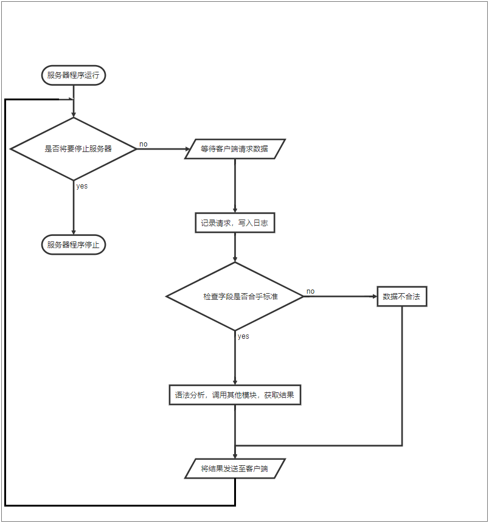

# LXHPassNote Structure
文档版本 1.0 2019-3-13

本文档描述了LXHPassNote服务端程序运行流程，以及各模块功能

### 目录

 * [Client/Server通信模块](#Client/Server通信模块)
    * [服务端身份的数据收发](#服务端身份的数据收发) 
    * [协议的语法分析，与其他的模块进行交互](#协议的语法分析，与其他的模块进行交互)
 * [邮件发送模块](#邮件发送模块)
 * [账户访问控制模块](#账户访问控制模块)
    * [账户注册、删除](#账户注册、删除)
    * [账户登录、注销](#账户登录、注销)
 * [主业务逻辑模块](#主业务逻辑模块)

### 配置读取模块


### Client/Server通信模块

文档：module_cs.md

本模块作为客户端与服务端交互的桥梁，包含以下功能：  
 1. 服务端身份的数据收发，支持SSL

 2. 协议的语法分析，与其他的模块进行交互

流程图



流程图代码：

```flow
start=>start: 服务器程序运行
end=>end: 服务器程序停止

listen=>inputoutput: 等待客户端请求数据
result=>inputoutput: 将结果发送至客户端

data_isvaild=>condition: 检查字段是否合乎标准
close_server=>condition: 是否将要停止服务器

log=>operation: 记录请求，写入日志
invaild_data=>operation: 数据不合法
call_module=>operation: 语法分析，调用其他模块，获取结果

start->close_server
close_server(no)->listen->log->data_isvaild
close_server(yes)->end
data_isvaild(no)->invaild_data->result->close_server
data_isvaild(yes)->call_module->result


```

### 账户访问控制模块

文档：module_ac.md

本模块用于账户的身份认证以及权限控制，提供以下功能：  

  1. 账户注册、删除 
  2. 账户登录、注销  
  3. 邮件发送

```flow

```

### 主业务逻辑模块  
本模块作为业务主逻辑处理核心，包含以下功能：  
