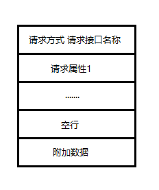
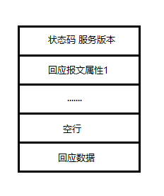

# LXHPassNote Protocol

文档版本 1.0 2019-3-13

本文档描述了LXHPassNote客户端与服务端通信时使用的协议

### 目录

### 客户端请求报文结构

* 每一个块的最后都应以<CR><LF>结尾，作为分隔符

* 请求方式以及请求属性参见下表

* 请求接口名称参见lxhpassnote_server_api.md，调用时请注意接口的请求属性要求，以及数据的返回

* 附加数据非必需，空行需在有附加数据的时候添加，其他时候不需要添加

  | 请求方式 | 说明                                                |
  | -------- | --------------------------------------------------- |
  | GET      | 使用GET方式向对应接口进行请求，后缀的附加数据会丢弃 |
  | POST     | 使用POST方式向对应接口进行请求，并传递附加数据      |

  

  

| 请求属性名     | 说明                           | 例子                            |
| -------------- | ------------------------------ | ------------------------------- |
| Host           | 指定接收请求的服务器           | Host: leaflxh.com               |
| Content-Type   | 指定附加数据的类型             | Content-Type: text;charset=utf8 |
| Content-Length | 指定附加数据的长度，单位为字节 | Content-Length: 233             |
|                |                                |                                 |

###  服务端回应报文结构

* 每一个块的最后同样需要以<CR><LF>结尾，作为分隔符

* 状态码、回应报文属性参见下表

* 服务版本为当前LXHPassNote-Server的版本

* 回应数据非必需，空行在有回应数据的时候添加，没有回应数据无需添加

| 状态码 | 说明                 |
| ------ | -------------------- |
| 200    | 请求成功，无错误发生 |
| 403    | 无权限请求当前接口   |
| 404    | 当前请求的接口不存在 |

